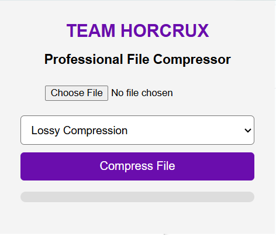

<h1 align="center">⚡ TEAM HORCRUX Compressor ⚡</h1>

<p align="center">
Professional Chrome Extension for File Compression
</p>

<p align="center">


</p>

---

## 🚀 About Project

TEAM HORCRUX Compressor is a modern Chrome Extension developed for quick and easy file compression directly inside the browser.

It provides:

✅ Lossy Compression  
✅ Lossless Compression  
✅ Download Compressed File  
✅ Progress Bar  
✅ Professional UI

---

## 🖼️ Preview

### Extension Popup


---

## 🎯 Features

| Feature | Available |
|--------|----------|
| File Upload | ✅ |
| Lossy Compression | ✅ |
| Lossless Compression | ✅ |
| Download File | ✅ |
| Progress Bar | ✅ |
| Clean UI | ✅ |

---

## 🛠 Built With

- HTML5
- CSS3
- JavaScript
- Chrome Extension API

---

## 📂 Installation

```bash
git clone https://github.com/darshit32562/TEAM-HORCRUX.git