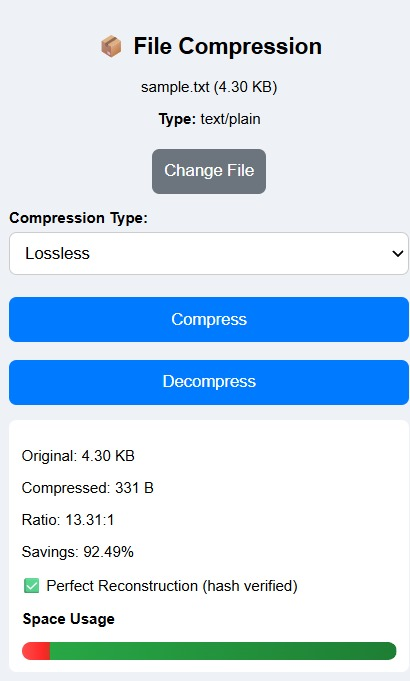
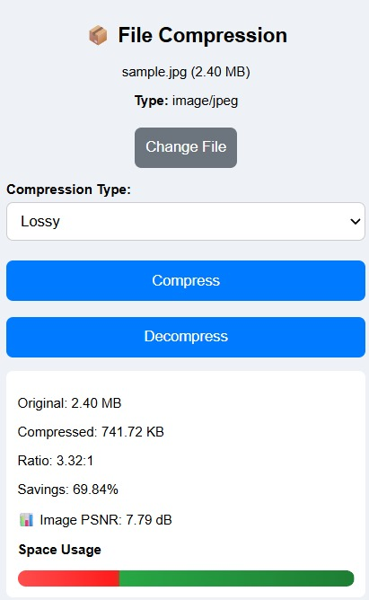

# 📦 File Compression Chrome Extension

**Team Horcrux**
**Status:** Submitted — Academic Project (MACS)

---

# 🔍 Overview

This project is a Chrome extension that allows users to compress and decompress files directly within the browser. It supports multiple file types including text (.txt, .csv), images (.png, .jpg), audio (.mp3, .wav), and video (.mp4). The extension uses a combination of lossless (Gzip) and lossy (image quality reduction) compression techniques depending on the file type. It also provides detailed metrics such as compression ratio, space savings, and reconstruction verification.

---

# 👥 Team Members

* Shreyas Mathur — UI Design & Frontend
* Darshit Aggarwal — Compression Logic
* Parv Singla — Decompression & File Handling
* Chirag — Metrics & Visualization
* Mahi Kataria — Testing & Sample Files
* Shweta — Documentation & README

---

# ⚙️ Features

* Supports multiple file types:

  * Text (.txt, .csv)
  * Images (.png, .jpg)
  * Audio (.mp3, .wav)
  * Video (.mp4)
* Compression methods:
  * Gzip (lossless) for text files
  * Canvas-based lossy compression for images
  * Basic processing for audio/video (limited compression due to pre-encoded formats)
* Displays:

  * Original file size
  * Compressed file size
  * Compression ratio
  * Space savings percentage
  * Quality Metrics:
  * PSNR for images
  * SNR for audio
* Decompression support:

  * Upload `.gz` files and restore original data
* Verification:
  * SHA-256 hash comparison for lossless compression
    (ensures byte-for-byte reconstruction)
  * PSNR (images) and SNR (audio) for lossy compression quality
* Drag-and-drop file upload
* Download compressed and decompressed files
* Error handling for invalid inputs
* Compression mode selection is dynamically adjusted based on file type
  (invalid options are disabled)

---

# 🛠 Installation

### Step 1: Download the project

Download or clone this repository to your local machine.

### Step 2: Open Chrome Extensions

Go to:

```
chrome://extensions
```

### Step 3: Enable Developer Mode

Toggle **Developer Mode** (top right corner).

### Step 4: Load the Extension

Click **"Load unpacked"** and select the project folder.

### Step 5: Pin Extension

Click the puzzle icon → pin the extension for easy access.

---

# ▶️ How to Use

### Compression

1. Open the extension
2. Upload a file (click or drag & drop)
3. Choose option (lossless/lossy) from dropdown. Note: Both options are not available for all file types.
4. Click **Compress**
5. View metrics (ratio, savings, etc.)
6. Click **Download Compressed**

### Decompression

1. Upload a `.gz` file OR compress first
2. Click **Decompress**
3. Download restored file

---

## 📊 Compression Results

| File Type    | Original Size | Compressed Size | Ratio  | Savings |
|-------------|--------------|----------------|--------|--------|
| Text (.txt) | 4.3 KB       | 0.331 KB       | 13.31:1 | 92.49% |
| Image (.jpg)| 2.4 MB       | 0.741 MB       | 3.32:1  | 69.84%  |
| Audio (.mp3)| 50.86 KB     | 48.54 KB       | 1.05:1  | 4.56%  |
| Video (.mp4)| 2.72 MB      | 1.890 MB        | 1.43:1  | 30.26%  |

---

# ✅ Rebuild Verification

### Lossless Files

* SHA-256 hash comparison used
* Matching hashes confirm perfect reconstruction

**Example: Perfect Reconstruction Verified using SHA-256**



### Lossy Files (Images)

* PSNR (Peak Signal-to-Noise Ratio) calculated
* Higher PSNR → better quality

**Example: Image Compression with PSNR**



# 🧠 Algorithm Explanation

### 1. Gzip Compression (via fflate.js)

* Used for: text files (effective), audio/video (limited impact)
* Type: Lossless
* Reason:

  * Fast and efficient
  * Widely used standard
  * Ensures exact reconstruction

---

### 2. Image Compression (Canvas API)

* Used for: .jpg, .png
* Type: Lossy
* Method:

  * Image drawn on canvas
  * Re-encoded with adjustable quality
* Reason:

  * Reduces file size significantly
  * Allows control over quality

---

### 3. Hashing (SHA-256)

* Used for: Verification
* Purpose:

  * Compare original vs decompressed file
* Reason:

  * Ensures data integrity

---

### 4. PSNR Metric

* Used for: Image quality evaluation
* Purpose:

  * Measure distortion after compression
* Reason:

  * Standard metric for lossy compression

---

# ⚠️ Limitations

* Large files (>10–20MB) may slow down browser
* Video/audio compression uses generic gzip (not optimized codecs)
* Image compression converts to JPEG (may lose transparency)
* Only `.gz` format supported for decompression
* Works best on Chromium-based browsers
* Browser-based audio decoding may fail for some formats, fallback methods are used

---

# 📚 References

* fflate.js library — for gzip compression
* MDN Web Docs — File API, Canvas API
* Chrome Extensions Documentation
* SHA-256 Web Crypto API
* PSNR formula references

---

# 📁 Sample Files

Sample test files are available in the `/samples` folder:

* Text (.txt)
* Images (.jpg)
* Audio (.mp3)
* Video (.mp4)

---

# 🚀 Conclusion

This extension demonstrates practical implementation of file compression techniques within a browser environment. It balances usability, performance, and educational value by combining multiple algorithms and metrics into a single tool.

---
